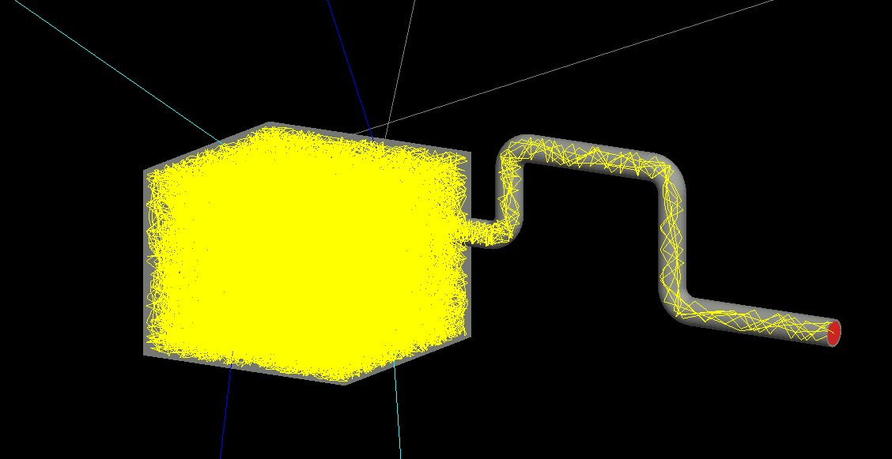

## Usage overview:
  1. Create GDML model of system to be simulated.
  2. Run application.

(See tutorial section below for examples.)



### Macro commands:

#### Detector commands (/detector/):
  1. Set maximum step size: "/detector/setMaxStep_mm <dx>".
     - <dx> is in millimeters. Default is 0.5 mm.
     - Must be followed by "/run/reinitializeGeometry" to take effect.
  2. Set maximum simulation time: "/detector/setMaxTime_s <t>".
     - <t> is in seconds. Default is 100.0 seconds.
     - Must be followed by "/run/reinitializeGeometry" to take effect.
#### Particle gun commands (/gun/):
  1. Set UCN initial KE: "/gun/gunEnergy_neV <e>".
     - <e> is in neV. Default is 100.0 neV.
  2. Set UCN initial position: "/gun/gunPosition <x> <y> <z>".
      - <x> <y> <z> are in millimeters. Default is  1.0 mm, 1.0 mm, 1.0 mm.
  3. Set UCN gun to random direction: "/gun/gunRandomDirection <b>".
      - <b> is "true" or "false". Default is "true".
  4. Set UCN gun direction: "/gun/gunDirection <Vx> <Vy> <Vz>".
      - <Vx> <Vy> <Vz> are unitless vector components.

### Inputs

1. **"snapshots.in":**
  Text file listing times ("tA_i") at which to take "snapshots". The snapshot is
  a list of the UCN time, energy, position, and momentum and time "tB_i" where
  "tB_i" is within some time window ("dt") after "tA_i". The file format is as
  follows (with times in seconds):
    ```
    line 1: dt
    line 2: tA_1
    line 3: tA_2
    ...
    line N: tA_{N-1}
    ```

### Outputs

1. **"snapshots.out":**
  Text file listing the snapshots. Line "j" may or may not be N-1 depending on
  if the UCN lasts that long. The next lines will be for subsequent UCNs. The
  total number depends on the number of runs. The file format is as follows (
  time is in seconds, KE is in neV, position is in mm, velocity is in m/s):
    ```
    line 1:   tB_1, KE(tB_1), (x,y,z)@(tB_1), (vx,vy,vz)@(tB_1)
    line 2:   tB_2, KE(tB_1), (x,y,z)@(tB_2), (vx,vy,vz)@(tB_2)
    ...
    line j:   tB_j, KE(tB_j), (x,y,z)@(tB_j), (vx,vy,vz)@(tB_j)
    line j+1: tB_1, KE(tB_1), (x,y,z)@(tB_1), (vx,vy,vz)@(tB_1)
    line j+2: tB_2, KE(tB_1), (x,y,z)@(tB_2), (vx,vy,vz)@(tB_2)
    ...
    ```

2. **"alive.out":**
  Text file listing the time that the UCN was "alive", i.e. how long it existed
  in the simulation. The first entry is the alive time in seconds. The second
  entry (vector) is the position where the UCN was created. The last entry
  (vector) is the position where the UCN was destroyed.

3. **"detector.out":**
  Text file listing the times and positions that UCNs were detected by a volume
  assigned the "Detector" material.

### Materials

#### Currently-implemented materials:
- "Copper":    naturally-occuring copper
- "CYTOP":     AGC Chemicals Company polyfluoromer
- "Detector":  very dense material with unity UCN loss factor (eta=1)
- "DLC":       diamond-like carbon, 100% sp3
- "DPE":       deuterated polyethylene
- "Fakeonium": a "fake" material for the user to apply to materials
- "Fomblin":   Fomblin Y LVAC 06/6, CF3O[CF(CF3)CF2O]x[CF2O]yCF3, x=y, polyfluoromer
- "Nickel":    naturally-occuring nickel
- "Steel":     naturally-occuring iron
- "Vacuum":    nothing (interstellar density hydrogen)

UCN material properties are stored in text files in the materials/ directory.
Basic material properties (density, composition, etc.) are listed in
materials/MATERIALS in the GDML XML format.

UCN materials properties are split into two categories, boundary and bulk.

**Boundary properties are:**
- "DIFFUSION" = probability of diffuse reflection via Lambert model.
- "FERMIPOT" = Fermi potential in neV
- "SPINFLIP" = probability of a spin flip (not implemented)
- "LOSS" = loss factor eta (or f) ratio of imaginary and real parts of Fermi potential (W/V)

**Bulk properties are:**
- "LOSSCS" = loss cross section in barns, doesn't take into account UCN velocity, set to zero if "ABSCS" is used
- "ABSCS"  = absorption cross section in barns (preferred)
- "SCATCS" = total scattering cross section in barns


## Tutorials

### Basic example:
  1. The basic example consists of a "source" box with a hole in it leading to
     pipe terminated by a detector.
  2. To build and run...
      ```
      $ git clone https://github.com/tneulinger/UCN
      $ cd UCN
      $ mkdir build
      $ cd build
      $ cmake ../
      $ make
      $ cp ../models/example/*.gdml ./
      $ ./UCN example.gdml
      ```
  3. Some basic UI commands are...
      ```
      /run/beamOn 1
      /gun/gunEnergy_neV 60
      ```
  4. Run information is output to "snapshots.out", "alive.out", and
     "detector.out".

     ```

## Add new material:
  1. Update materials/MATERIALS with desired material according to GDML XML format.
  2. Add "NewMaterial.txt" to materials/ directory with proper format.
